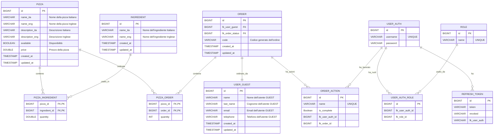

```mermaid
erDiagram

PIZZA {
    BIGINT id PK
    VARCHAR name_ita "Nome della pizza Italiano"
    VARCHAR name_eng "Nome della pizza Inglese"
    VARCHAR description_ita "Descrizione Italiano"
    VARCHAR description_eng "Descrizione Inglese"
    BOOLEAN available "Disponibilità"
    DOUBLE price "Prezzo della pizza"
    TIMESTAMP created_at
    TIMESTAMP updated_at
}

USER_GUEST {
    BIGINT id PK
    VARCHAR name "Nome dell'utente GUEST"
    VARCHAR last_name "Cognome dell'utente GUEST"
    VARCHAR email "Email dell'utente GUEST"
    VARCHAR telephone "Telefono dell'utente GUEST"
    TIMESTAMP created_at
    TIMESTAMP updated_at
}

INGREDIENT {
    BIGINT id PK
    VARCHAR name_ita "Nome dell'ingrediente Italiano"
    VARCHAR name_eng "Nome dell'ingrediente Inglese"
    TIMESTAMP created_at
    TIMESTAMP updated_at
}

ORDER {
    BIGINT id PK
    BIGINT fk_user_guest FK
    BIGINT fk_order_status FK
    VARCHAR code "Codice generato dell'ordine"
    TIMESTAMP created_at
    TIMESTAMP updated_at
}
  

PIZZA_INGREDIENT {
    BIGINT pizza_id FK, PK
    BIGINT ingredient_id FK, PK
    DOUBLE quantity
}


PIZZA_ORDER {
    BIGINT pizza_id FK, PK
    BIGINT order_id FK, PK
    INT quantity
}

ROLE {
    BIGINT id PK
    VARCHAR name "UNIQUE"
}

USER_AUTH {
    BIGINT id PK
    VARCHAR username "UNIQUE"
    VARCHAR password
}

USER_AUTH_ROLE {
    BIGINT id PK
    BIGINT fk_user_auth_id
    BIGINT fk_role_id
}

REFRESH_TOKEN {
    BIGINT id PK
    VARCHAR token
    VARCHAR revoked
    VARCHAR fk_user_auth
}

ORDER_ACTION {
    BIGINT id PK
    VARCHAR name "UNIQUE"
    Boolean is_complete
    BIGINT fk_user_auth_id
    BIGINT fk_order_id
}

PIZZA ||--o{ PIZZA_INGREDIENT : contiene
INGREDIENT ||--o{ PIZZA_INGREDIENT : usato_in

PIZZA ||--o{ PIZZA_ORDER : ordinata
ORDER ||--o{ PIZZA_ORDER : contiene

ORDER ||--|| USER_GUEST : "ordinato_da"

ORDER ||--o{ ORDER_ACTION : "ha_azioni"
USER_AUTH ||--o{ ORDER_ACTION : "ha_lavorato"

USER_AUTH ||--o{ USER_AUTH_ROLE : ha_ruoli
ROLE ||--o{ USER_AUTH_ROLE : usato_da

USER_AUTH ||--o{ REFRESH_TOKEN : ha
```